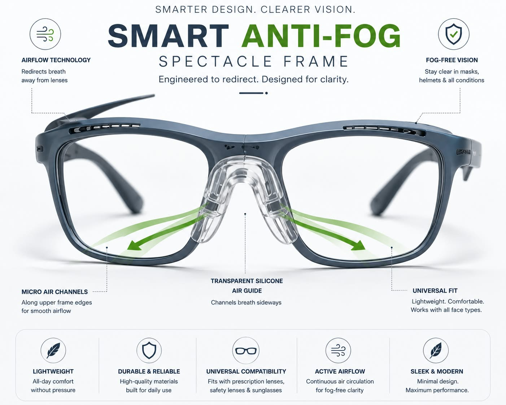
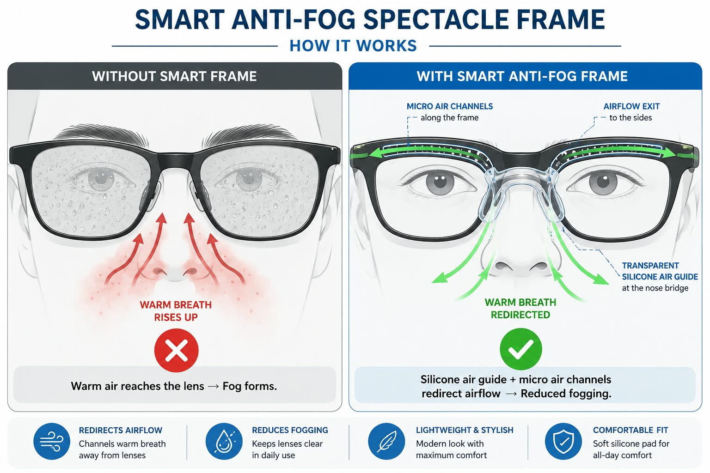
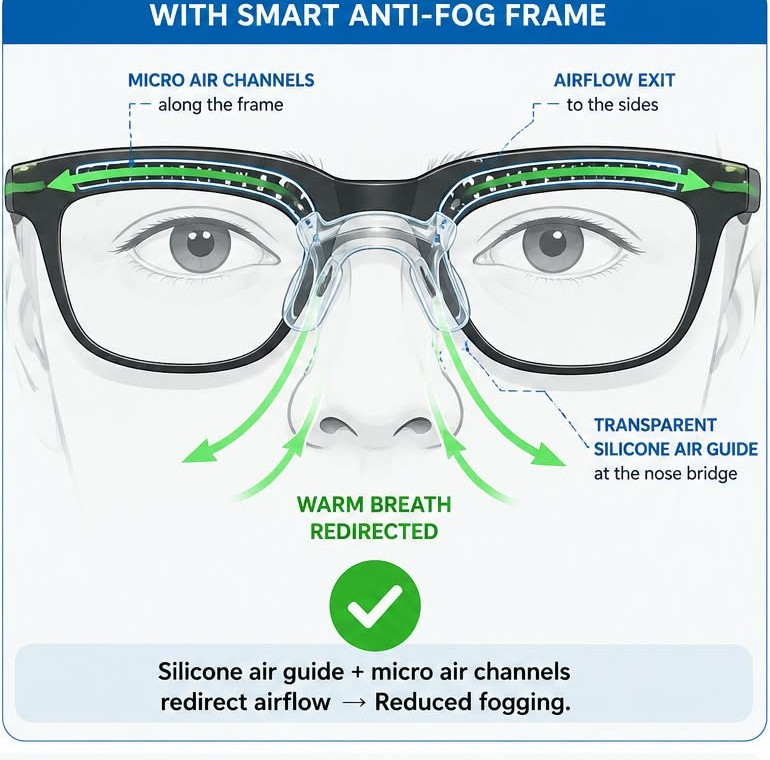
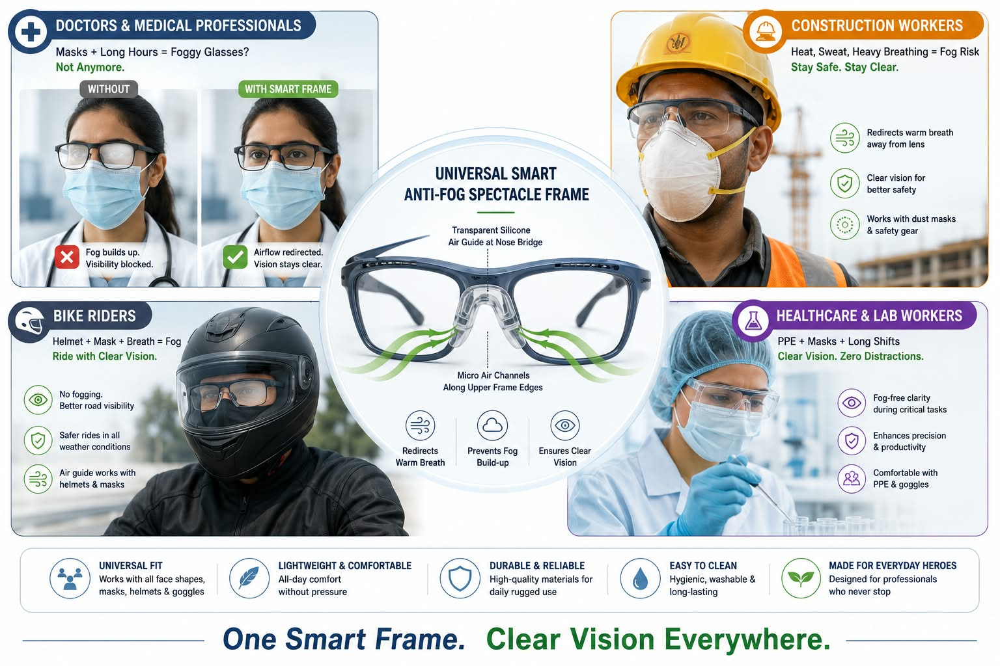
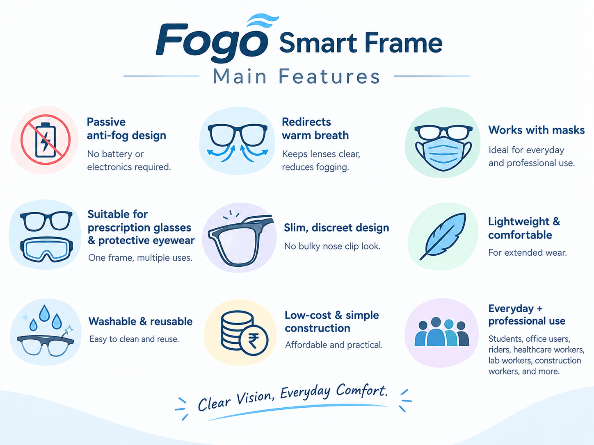
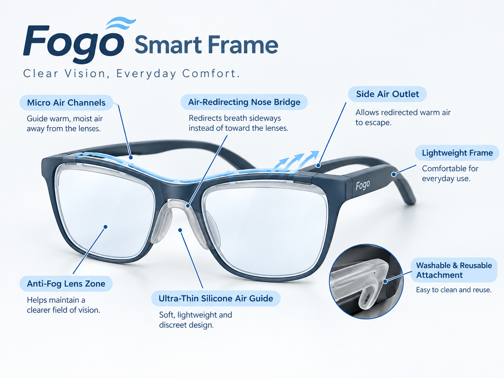

# Fogo Smart Frame 👓

### A simple, lightweight approach to everyday anti-fog eyewear

**Fogo Smart Frame** is a conceptual anti-fog spectacle frame designed to reduce lens fogging caused by warm, moisture-rich breath, especially during mask usage and temperature changes.

The concept focuses on **passive airflow guidance** rather than batteries or electronic components. A thin transparent silicone air guide near the nose bridge and micro air channels along the frame are designed to redirect warm airflow away from the lens area.

---

## 🚨 The Problem

Eyeglass lenses can fog when warm, humid air reaches a cooler lens surface.

This can happen during:

- 😷 Mask usage
- 🏥 Healthcare and laboratory work
- 🏗️ Construction and protective-wear environments
- 🏍️ Bike riding and outdoor activities
- 🍲 Exposure to warm food or steam
- ❄️ Moving between warm and air-conditioned environments

---

## 💡 The Fogo Concept

The main idea is simple:

> **Guide warm breath away from the lens before it causes significant fogging.**

The concept uses:

- A **thin transparent silicone air guide** near the nose bridge
- **Micro air channels** along the upper frame
- Side openings for redirected airflow
- A lightweight frame concept designed to work with prescription eyewear

The core concept is **passive** and does not require batteries, motors, or electronic prediction.

---

## ⚙️ How It Works

### 1. Warm breath is generated
Exhaled air contains heat and moisture.

### 2. Airflow is guided
The transparent silicone air guide helps redirect warm airflow away from the lens area.

### 3. Air moves through the channels
The proposed micro air channels provide a guided path toward the sides of the frame.

### 4. Airflow exits sideways
The redirected airflow leaves through the side openings.

### 5. Fogging may be reduced
Reducing direct exposure of the lens to warm humid airflow may help reduce fog formation under suitable conditions.

> **Note:** This is a concept/prototype-stage design. Actual fog-reduction performance requires controlled testing.

---

## 🖼️ Project Visuals

### Fogo Smart Frame

### How It Works

### Airflow Concept

### Applications

### Key Features

### Labeled Design

---

## ✨ Key Features

- Lightweight frame concept
- Passive airflow-based design
- No battery or motor required
- Thin transparent silicone air guide
- Micro air channels
- Prescription-eyewear compatibility as a design goal
- Washable/reusable concept
- Suitable for everyday and protective-use scenarios

---

## 🎯 Potential Applications

The concept can be explored for:

- Doctors and healthcare workers
- Laboratory workers
- Construction workers
- Bike riders
- Students
- Office users
- People who frequently wear masks
- Users working in warm, humid, or changing environments

---

## 🧠 Design Approach

Fogo focuses on solving an everyday problem through **physical airflow management** rather than continuous electronic control.

**Simple • Lightweight • Reusable • Battery-free • Practical**

AI or sensors could be explored in future versions for environmental monitoring or adaptive airflow control, but they are **not required for the core passive concept**.

---

## 🎥 Project Demo

A demonstration of the Fogo Smart Frame concept is available below:

**[▶️ Watch / Open the Fogo Smart Frame Demo](Fogo_Demo_16x9-2.mp4)**

---

## 📄 Project Documentation

Detailed project documentation, including the concept, working principle, applications, development plan, and limitations:

**[📘 View Fogo Smart Frame Documentation](Fogo-Smart-Frame-Documentation-Illustrated.pdf)**

---

## 🏆 Hackathon

### AI Conclave 2026 — Hackathon

**Organized by:** Amal Jyothi College of Engineering  
**Date:** 16 September 2026

Fogo Smart Frame was developed and presented as a project concept during the hackathon.

---

## 🔬 Future Development

Possible future work includes:

- Physical prototype fabrication
- Controlled fogging tests
- Airflow visualization and simulation
- Optimization of channel geometry
- Fit and comfort testing
- Material and durability testing
- Improved cleaning and maintenance design
- Exploration of optional sensor/AI-assisted versions

---

## ⚠️ Limitations

Fogo Smart Frame is currently a **concept/prototype-stage project**.

Actual performance will depend on factors such as:

- Face and frame fit
- Airflow geometry
- Breathing pattern
- Temperature
- Humidity
- Wind conditions
- Material selection
- Final manufacturing

Controlled testing is required before making specific performance claims or considering safety-critical or medical applications.

---

## 👩‍💻 Project

**Fogo Smart Frame**

Concept and project documentation by **Ganga P G**

GitHub: **pgganga9-art**

---

### Clear Vision, Everyday Comfort. 👓
